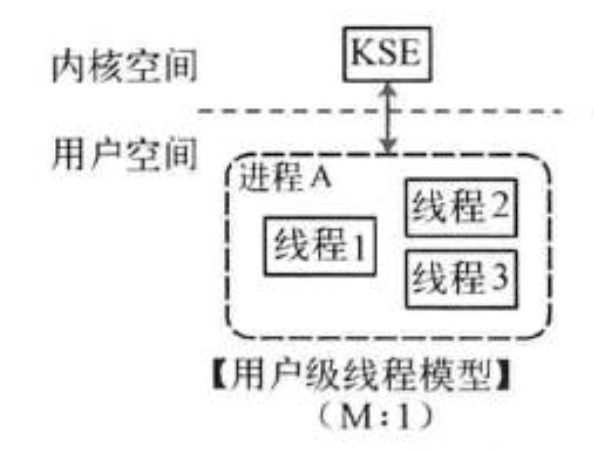
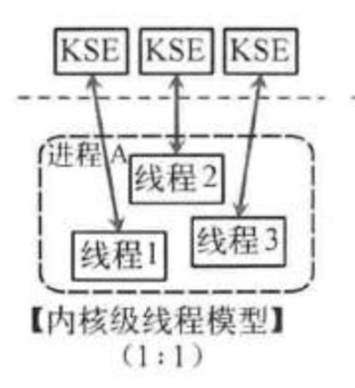
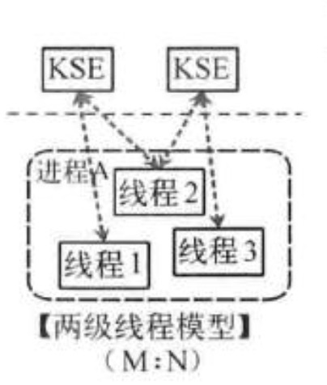
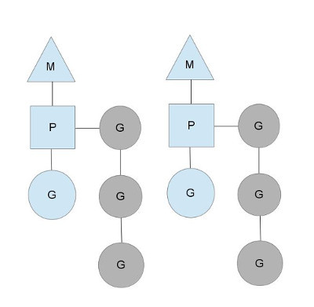
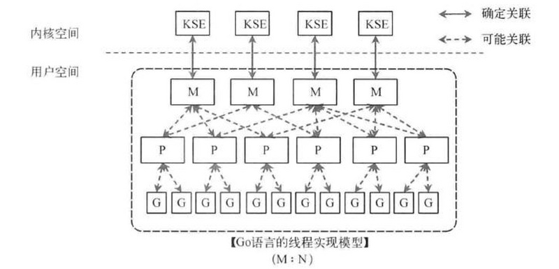
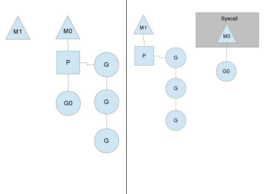
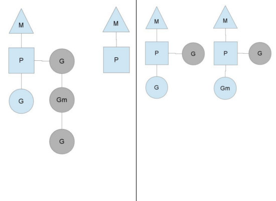

# Go并发模型原理

参考学习自 https://segmentfault.com/a/1190000018150987

无论语言层面何种并发模型，到了操作系统层面，一定是以线程的形态存在的。而操作系统根据资源访问权限的不同，体系架构可分为用户空间和内核空间；内核空间主要操作访问CPU资源、I/O资源、内存资源等硬件资源，为上层应用程序提供最基本的基础资源，用户空间呢就是上层应用程序的固定活动空间，用户空间不可以直接访问资源，必须通过“系统调用”、“库函数”或“Shell脚本”来调用内核空间提供的资源。

我们现在的计算机语言，可以狭义的认为是一种“软件”，它们中所谓的“线程”，往往是用户态的线程，和操作系统本身内核态的线程（简称KSE），还是有区别的。

线程模型的实现，可以分为以下几种方式：

## 用户级线程模型

多个用户态的线程对应着一个内核线程，程序线程的创建、终止、切换或者同步等线程工作必须自身来完成。它可以做快速的上下文切换。缺点是不能有效利用多核CPU。

## 内核级线程模型

这种模型直接调用操作系统的内核线程，所有线程的创建、终止、切换、同步等操作，都由内核来完成。一个用户态的线程对应一个系统线程，它可以利用多核机制，但上下文切换需要消耗额外的资源。C++就是这种。

## 两级线程模型

这种模型是介于用户级线程模型和内核级线程模型之间的一种线程模型。这种模型的实现非常复杂，和内核级线程模型类似，一个进程中可以对应多个内核级线程，但是进程中的线程不和内核线程一一对应；这种线程模型会先创建多个内核级线程，然后用自身的用户级线程去对应创建的多个内核级线程，自身的用户级线程需要本身程序去调度，内核级的线程交给操作系统内核去调度。

M个用户线程对应N个系统线程，缺点增加了调度器的实现难度。

Go语言的线程模型就是一种特殊的两级线程模型（GPM调度模型）。

## Go线程实现模型MPG

`M`指的是`Machine`，一个`M`直接关联了一个内核线程。由操作系统管理。
`P`指的是”processor”，代表了`M`所需的上下文环境，也是处理用户级代码逻辑的处理器。它负责衔接M和G的调度上下文，将等待执行的G与M对接。
`G`指的是`Goroutine`，其实本质上也是一种轻量级的线程。包括了调用栈，重要的调度信息，例如channel等。

P的数量由环境变量中的`GOMAXPROCS`决定，通常来说它是和核心数对应，例如在4Core的服务器上回启动4个线程。G会有很多个，每个P会将Goroutine从一个就绪的队列中做Pop操作，为了减小锁的竞争，通常情况下每个P会负责一个队列。

三者关系如下图所示：

以上这个图讲的是两个线程(内核线程)的情况。一个**M**会对应一个内核线程，一个**M**也会连接一个上下文**P**，一个上下文**P**相当于一个“处理器”，一个上下文连接一个或者多个Goroutine。为了运行goroutine，线程必须保存上下文。

上下文P(Processor)的数量在启动时设置为`GOMAXPROCS`环境变量的值或通过运行时函数`GOMAXPROCS()`。通常情况下，在程序执行期间不会更改。上下文数量固定意味着只有固定数量的线程在任何时候运行Go代码。我们可以使用它来调整Go进程到个人计算机的调用，例如4核PC在4个线程上运行Go代码。

图中P正在执行的`Goroutine`为蓝色的；处于待执行状态的`Goroutine`为灰色的，灰色的`Goroutine`形成了一个队列`runqueues`。

Go语言里，启动一个goroutine很容易：go function 就行，所以每有一个go语句被执行，runqueue队列就在其末尾加入一个goroutine，一旦上下文运行goroutine直到调度点，它会从其runqueue中弹出goroutine，设置堆栈和指令指针并开始运行goroutine。

#### 抛弃P(Processor)

你可能会想，为什么一定需要一个上下文，我们能不能直接除去上下文，让`Goroutine`的`runqueues`挂到M上呢？答案是不行，需要上下文的目的，是让我们可以直接放开其他线程，当遇到内核线程阻塞的时候。

一个很简单的例子就是系统调用`sysall`，一个线程肯定不能同时执行代码和系统调用被阻塞，这个时候，此线程M需要放弃当前的上下文环境P，以便可以让其他的`Goroutine`被调度执行。

如上图左图所示，M0中的G0执行了syscall，然后就创建了一个M1(也有可能来自线程缓存)，（转向右图）然后M0丢弃了P，等待syscall的返回值，M1接受了P，将·继续执行`Goroutine`队列中的其他`Goroutine`。

当系统调用syscall结束后，M0会“偷”一个上下文，如果不成功，M0就把它的Gouroutine G0放到一个全局的runqueue中，将自己置于线程缓存中并进入休眠状态。全局runqueue是各个P在运行完自己的本地的Goroutine runqueue后用来拉取新goroutine的地方。P也会周期性的检查这个全局runqueue上的goroutine，否则，全局runqueue上的goroutines可能得不到执行而饿死。

#### 均衡的分配工作

按照以上的说法，上下文P会定期的检查全局的goroutine 队列中的goroutine，以便自己在消费掉自身Goroutine队列的时候有事可做。假如全局goroutine队列中的goroutine也没了呢？就从其他运行的中的P的runqueue里偷。

每个P中的`Goroutine`不同导致他们运行的效率和时间也不同，在一个有很多P和M的环境中，不能让一个P跑完自身的`Goroutine`就没事可做了，因为或许其他的P有很长的`goroutine`队列要跑，得需要均衡。
该如何解决呢？

Go的做法倒也直接，从其他P中偷一半！

# Goroutine 小结

优点：

1、开销小

POSIX的thread API虽然能够提供丰富的API，例如配置自己的CPU亲和性，申请资源等等，线程在得到了很多与进程相同的控制权的同时，开销也非常的大，在Goroutine中则不需这些额外的开销，所以一个Golang的程序中可以支持10w级别的Goroutine。

每个 goroutine (协程) 默认占用内存远比 Java 、C 的线程少（*goroutine：*2KB ，线程：8MB）

2、调度性能好

在Golang的程序中，操作系统级别的线程调度，通常不会做出合适的调度决策。例如在GC时，内存必须要达到一个一致的状态。在Goroutine机制里，Golang可以控制Goroutine的调度，从而在一个合适的时间进行GC。

在应用层模拟的线程，它避免了上下文切换的额外耗费，兼顾了多线程的优点。简化了高并发程序的复杂度。

缺点：

协程调度机制无法实现公平调度。