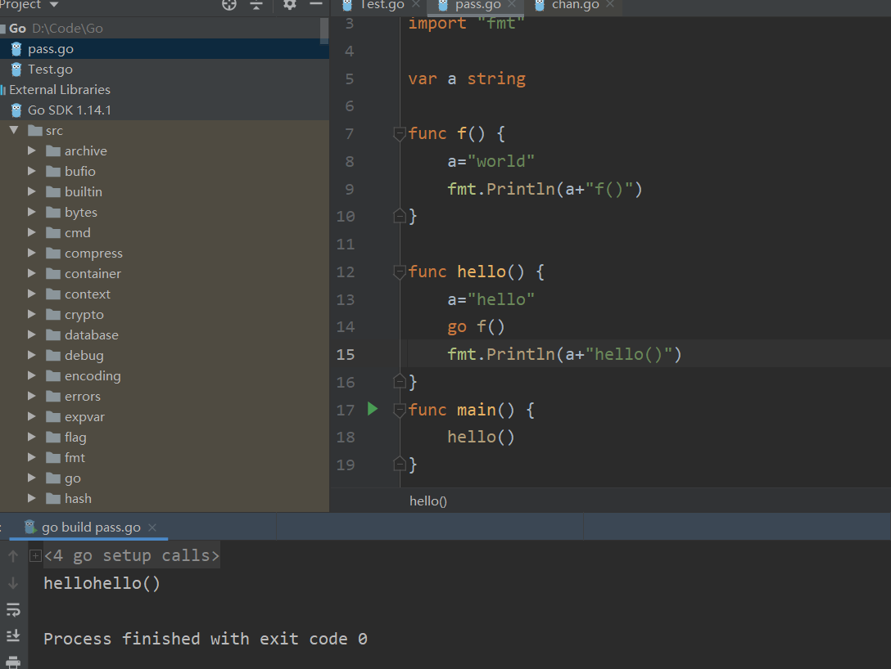

# Go程通信及数据安全

### JMM

阅读过《JAVA并发编程艺术》的同学应该都知道java的内存模型JMM,jmm中，每个线程都有自己的缓存区域，线程对共享变量的修改操作分为三步：

1. 从主内存中读取变量的值并存入自己的缓存区。
2. 修改缓存区中的变量值。
3. 将缓存区的变量值写回主内存。

在JAVA中线程并发对共享内存操作可能会导致数据不安全（操作被覆盖等）问题,为此JAVA推荐使用JUC包中的线程安全类进行线程控制和管理。

### goroutine

#### go程通信

**ps:如果你看了本篇文章请一定要看到最后，因为很有前面的结论是通过现象总结，但很多时候现象是表面的，只是感性的，最后结论是翻看资料得到的正确的，这是一个不断否定自己的过程。**

相比于java中线程使用共享内存进行通信，go程中，不同go程操作共享变量对对方是不可见的，如果没有chan进行通信，那么**不同go程的变量值都是各自的隔离**的值，类似于java的threadlocal。下面的例子给大🔥康康

~~~go
package main

import "fmt"

var a string

func f() {
	a="world"
	fmt.Println(a)
}

func hello() {
	a="hello"
	go f()
	fmt.Println(a)
}
func main() {
	hello()
}
~~~

这个例子会输出world\nhello  ,我们可以发现既然先输出了world，那么a肯定在f中已经被赋值为world，但是在hello输出时却还是输出的hello。说明**hello也就是主go程中的值没有收到f()go程的修改**。

那么为了让不同go程通信，go引入了管道，看如下的例子

~~~go
package main

import (
	"fmt"
)

var a string
var messages =make(chan string)
func f() {
	a="world"
	fmt.Println(a)
	messages <-a
}

func hello() {
	a="hello"
	go f()
	a = <-messages
	fmt.Println(a)
}
func main() {
	hello()
}
~~~

结果想必大家都知道，会打印两个world。

但是如果不使用chan传递a呢？如果我传递别的值，a的修改是否可以被看见呢，来看下面的例子：

~~~go
package main

import "fmt"

var c = make(chan int, 10)
var a = "hello"

func f() {
	a = " world"
	c <- 0
}

func main() {
	go f()
	<-c
	fmt.Println(a)
}
~~~

你可能会觉得输出是hello，但很遗憾输出的是world,那么我们可以可以得到另一个结论，**如果两个go程之间有同步机制（也就是chan）那么，执行chan<-data的go程中所有数据对执行<-chan的go程都是可见的**

那么除了chan我们还有其他相互访问的机制吗，当然是有的chan本质也就是一个同步机制，go中最重要的思想就是happen-before，因为在java中线程运行顺序是不确定的，所以对变量操作时没有happen-before的关系（没使用同步策略时），这才导致了java中数据不安全，go语言考虑到这点，**规定，对于两个没有同步措施的go程，互相不能看到对方的共享变量值，而只能看到共享变量的初始值。而有同步措施的两个go程，也只能看到做同步措施时间节点前的操作。**

那么其他的同步措施例如锁，在go中的一个例子如下：

~~~go
var l sync.Mutex
var a string
 
func f() {
        a = "hello, world"
        l.Unlock()
}
 
func main() {
        l.Lock()
        go f()
        l.Lock()
        print(a)
}
~~~

会输出hello world

所以得到结论**不同go程必须有同步措施才能进行通信，无论是直接通信还是共享变量**

但这是否意味着go程的完全隔离呢？其实不是的，**如果一个go程结束，那么另一个go程是可以感知到这个go程对变量的操作的**。请看下例：

~~~go
var a, b int

func f() {
	a = 1
	b = 2
}

func g() {
	print(b)
	print(a)
}

func main() {
	go f()
	g()
}
~~~

其结果大部分是0 1，少部分是 0 0    **注：官方文档中表明可能会发生 `g` 打印出 `2` 之后再打印出 `0`。读取操作 *r* 可能监测到与其并发的写入操作 *w* 写入的值。即便如此，也并不意味着发生在 *r* 之后的读取操作会监测到发生在 *w* 之前的写入操作。**但我在测试了十几遍都是01或00，并没有出现2 0的情况，可能是版本更新，也可能是太少见了。官方翻译文档为：http://docscn.studygolang.com/ref/mem

但如果我们加一行，确保go f()运行结束，才调用g()，如下：

~~~go
package main

import "time"

var a, b int

func f() {
	a = 1
	b = 2
}

func g() {
	print(b)
	print(a)
}

func main() {
	go f()
	time.Sleep(time.Duration(2)*time.Second)
	g()
}
~~~

会发现结果很稳定的是2 1

### 疑惑点

为什么我加了一定会输出f()，但是却没有输出。

再去查看，才知道：==**goroutine的fork-join模型。在程序的任一节点，可用让父子可以同时运行，并在未来的某一节点合并在一起。如果没有合并，子分支甚至可能没有机会运行，因为此时主分支已经退出。**==

也就是说：==**go并不保证所有的go程都能运行，如果不加同步机制你的go程可能根本不会被运行**==

这也就是为什么前面的那些代码会出现那些结果，把前面的结论都推翻，你只要记住上面两条高亮，所有的情况都能推断出原因。

