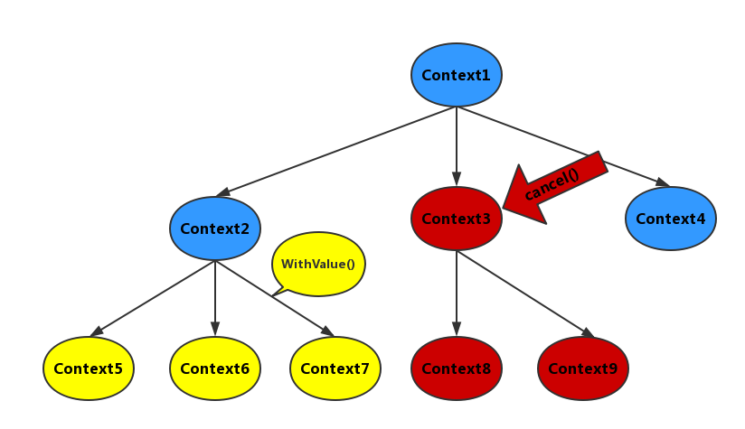

# go并发控制

经过多次测试并结合官方的说法，实现控制并发的方式，大致可分成以下三类：

### 全局共享变量

1. 声明一个全局变量；
2. 所有子goroutine共享这个变量，并不断轮询这个变量检查是否有更新；
3.  在主进程中变更该全局变量；
4. 子goroutine检测到全局变量更新，执行相应的逻辑。

这最好只用于控制并发，如下例子

~~~go
package main

import (
    "fmt"
    "time"
)

func main() {
    running := true
    f := func() {
        for running {
            fmt.Println("sub proc running...")
            time.Sleep(1 * time.Second)
        }
        fmt.Println("sub proc exit")
    }
    go f()
    go f()
    go f()
    time.Sleep(2 * time.Second)
    running = false
    time.Sleep(3 * time.Second)
    fmt.Println("main proc exit")
}
~~~

让三个子线程一直等待，直到能感知到主go程中的变化。好处是简单，坏处就是面对复杂逻辑无法胜任。

### channel通信

这就是典型的定点fork方法，不多说了。如果想看channel详解，我一定会写的，找github就完事了。

### Context包

> Context通常被译作上下文，它是一个比较抽象的概念。在讨论链式调用技术时也经常会提到上下文。一般理解为程序单元的一个运行状态、现场、快照，而翻译中上下又很好地诠释了其本质，上下则是存在上下层的传递，上会把内容传递给下。在Go语言中，程序单元也就指的是Goroutine。
>
> 每个Goroutine在执行之前，都要先知道程序当前的执行状态，通常将这些执行状态封装在一个Context变量中，传递给要执行的Goroutine中。上下文则几乎已经成为传递与请求同生存周期变量的标准方法。在网络编程下，当接收到一个网络请求Request，在处理这个Request的goroutine中，可能需要在当前gorutine继续开启多个新的Goroutine来获取数据与逻辑处理（例如访问数据库、RPC服务等），即一个请求Request，会需要多个Goroutine中处理。而这些Goroutine可能需要共享Request的一些信息；同时当Request被取消或者超时的时候，所有从这个Request创建的所有Goroutine也应该被结束。

Context的创建和调用关系是层层递进的，也就是我们通常所说的链式调用，类似数据结构里的树，从根节点开始，每一次调用就衍生一个叶子节点。首先，生成根节点，使用context.Background方法生成，而后可以进行链式调用使用context包里的各类方法，context包里的所有方法：
\- func Background() Context
\- func TODO() Context
\- func WithCancel(parent Context) (ctx Context, cancel CancelFunc)
\- func WithDeadline(parent Context, deadline time.Time) (Context, CancelFunc)
\- func WithTimeout(parent Context, timeout time.Duration) (Context, CancelFunc)
\- func WithValue(parent Context, key, val interface{}) Context

这里仅以WithCancel和WithValue方法为例来实现控制并发和通信：
话不多说，上码：

```go
package main

import (
    "context"
    "crypto/md5"
    "fmt"
    "io/ioutil"
    "net/http"
    "sync"
    "time"
)

type favContextKey string

func main() {
    wg := &sync.WaitGroup{}
    values := []string{"https://www.baidu.com/", "https://www.zhihu.com/"}
    ctx, cancel := context.WithCancel(context.Background())

    for _, url := range values {
        wg.Add(1)
        subCtx := context.WithValue(ctx, favContextKey("url"), url)
        go reqURL(subCtx, wg)
    }

    go func() {
        time.Sleep(time.Second * 3)
        cancel()
    }()

    wg.Wait()
    fmt.Println("exit main goroutine")
}

func reqURL(ctx context.Context, wg *sync.WaitGroup) {
    defer wg.Done()
    url, _ := ctx.Value(favContextKey("url")).(string)
    for {
        select {
        case <-ctx.Done():
            fmt.Printf("stop getting url:%s\n", url)
            return
        default:
            r, err := http.Get(url)
            if r.StatusCode == http.StatusOK && err == nil {
                body, _ := ioutil.ReadAll(r.Body)
                subCtx := context.WithValue(ctx, favContextKey("resp"), fmt.Sprintf("%s%x", url, md5.Sum(body)))
                wg.Add(1)
                go showResp(subCtx, wg)
            }
            r.Body.Close()
            //启动子goroutine是为了不阻塞当前goroutine，这里在实际场景中可以去执行其他逻辑，这里为了方便直接sleep一秒
            // doSometing()
            time.Sleep(time.Second * 1)
        }
    }
}

func showResp(ctx context.Context, wg *sync.WaitGroup) {
    defer wg.Done()
    for {
        select {
        case <-ctx.Done():
            fmt.Println("stop showing resp")
            return
        default:
            //子goroutine里一般会处理一些IO任务，如读写数据库或者rpc调用，这里为了方便直接把数据打印
            fmt.Println("printing ", ctx.Value(favContextKey("resp")))
            time.Sleep(time.Second * 1)
        }
    }
}
```

前面我们说过Context就是设计用来解决那种多个goroutine处理一个Request且这多个goroutine需要共享Request的一些信息的场景，以上是一个简单模拟上述过程的demo。

首先调用context.Background()生成根节点，然后调用withCancel方法，传入根节点，得到新的子Context以及根节点的cancel方法（通知所有子节点结束运行），这里要注意：该方法也返回了一个Context，这是一个新的子节点，与初始传入的根节点不是同一个实例了，但是每一个子节点里会保存从最初的根节点到本节点的链路信息 ，才能实现链式。

程序的reqURL方法接收一个url，然后通过http请求该url获得response，然后在当前goroutine里再启动一个子groutine把response打印出来，然后从ReqURL开始Context树往下衍生叶子节点（每一个链式调用新产生的ctx）,中间每个ctx都可以通过WithValue方式传值（实现通信），而每一个子goroutine都能通过Value方法从父goroutine取值，实现协程间的通信，每个子ctx可以调用Done方法检测是否有父节点调用cancel方法通知子节点退出运行，根节点的cancel调用会沿着链路通知到每一个子节点，因此实现了强并发控制，流程如图：

该demo结合前面说的WaitGroup实现了优雅并发控制和通信，关于WaitGroup的原理和使用前文已做解析，这里便不再赘述，当然，实际的应用场景不会这么简单，处理Request的goroutine启动多个子goroutine大多是处理IO密集的任务如读写数据库或rpc调用，然后在主goroutine中继续执行其他逻辑，这里为了方便讲解做了最简单的处理。

Context作为golang中并发控制和通信的大杀器，被广泛应用，一些使用go开发http服务的同学如果阅读过这些很多 web framework的源码就知道，Context在web framework随处可见，因为http请求处理就是一个典型的链式过程以及并发场景，所以很多web framework都会借助Context实现链式调用的逻辑。有兴趣可以读一下context包的源码，会发现Context的实现其实是结合了Mutex锁和channel而实现的，其实并发、同步的很多高级组件万变不离其宗，都是通过最底层的数据结构组装起来的，只要知晓了最基础的概念，上游的架构也可以一目了然。

**context使用规范**

最后，Context虽然是神器，但开发者使用也要遵循基本法，以下是一些Context使用的规范：
\- Do not store Contexts inside a struct type; instead, pass a Context explicitly to each function that needs it. The Context should be the first parameter, typically named ctx；不要把Context存在一个结构体当中，显式地传入函数。Context变量需要作为第一个参数使用，一般命名为ctx；

- Do not pass a nil Context, even if a function permits it. Pass context.TODO if you are unsure about which Context to use；即使方法允许，也不要传入一个nil的Context，如果你不确定你要用什么Context的时候传一个context.TODO；
- Use context Values only for request-scoped data that transits processes and APIs, not for passing optional parameters to functions；使用context的Value相关方法只应该用于在程序和接口中传递的和请求相关的元数据，不要用它来传递一些可选的参数；
- The same Context may be passed to functions running in different goroutines; Contexts are safe for simultaneous use by multiple goroutines；同样的Context可以用来传递到不同的goroutine中，Context在多个goroutine中是安全的；