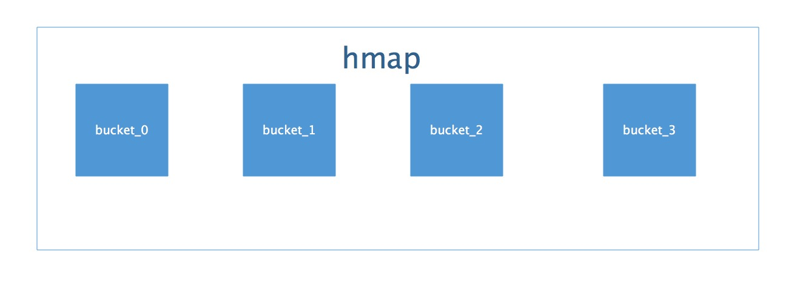

# `map`的整体结构图

Golang中`map`的底层实现是一个散列表，因此实现`map`的过程实际上就是实现散表的过程。在这个散列表中，主要出现的结构体有两个，一个叫`hmap`(`a header for a go map`)，一个叫`bucket`。这两种结构的样子分别如下所示：

hmap:


图中有很多字段，但是便于理解`map`的架构，你只需要关心的只有一个，就是标红的字段：buckets数组。Golang的map中用于存储的结构是bucket数组。而bucket(即`bmap`)的结构是怎样的呢？

bucket：


相比于`hmap`，bucket的结构显得简单一些，标红的字段依然是“核心”，我们使用的`map`中的key和value就存储在这里。“高位哈希值”数组记录的是当前bucket中key相关的“索引”，稍后会详细叙述。还有一个字段是一个指向扩容后的bucket的指针，使得bucket会形成一个链表结构。例如下图：


由此看出`hmap`和`bucket`的关系是这样的：



而bucket又是一个链表，所以，整体的结构应该是这样的：


哈希表的特点是会有一个哈希函数，对你传来的key进行哈希运算，得到唯一的值，一般情况下都是一个数值。Golang的`map`中也有这么一个哈希函数，也会算出唯一的值，对于这个值的使用，Golang也是很有意思。

Golang把求得的值按照用途一分为二：高位和低位。


如图所示，蓝色为高位，红色为低位。 然后低位用于寻找当前key属于`hmap`中的哪个bucket，而高位用于寻找bucket中的哪个key。上文中提到：bucket中有个属性字段是“高位哈希值”数组，这里存的就是蓝色的高位值，用来声明当前bucket中有哪些“key”，便于搜索查找。 需要特别指出的一点是：我们`map`中的key/value值都是存到同一个数组中的。数组中的顺序是这样的:


并不是key0/value0/key1/value1的形式，这样做的好处是：在key和value的长度不同的时候，可以消除padding带来的空间浪费。

现在，我们可以得到Go语言`map`的整个的结构图了：


以上，就是Go语言map的整体结构了。

# `map`的扩容

当以上的哈希表增长的时候，Go语言会将bucket数组的数量扩充一倍，产生一个新的bucket数组，并将旧数组的数据迁移至新数组。

## 加载因子

判断扩充的条件，就是哈希表中的`加载因子`(即loadFactor)。

`加载因子`是一个阈值，一般表示为：散列包含的元素数 除以 位置总数。是一种“产生冲突机会”和“空间使用”的平衡与折中：`加载因子`越小，说明空间空置率高，空间使用率小，但是`加载因子`越大，说明空间利用率上去了，但是“产生冲突机会”高了。

每种哈希表的都会有一个`加载因子`，数值超过`加载因子`就会为哈希表扩容。 Golang的`map`的`加载因子`的公式是：`map长度 / 2^B` 阈值是`6.5`。其中`B`可以理解为已扩容的次数。

当Go的`map`长度增长到大于`加载因子`所需的`map`长度时，Go语言就会将产生一个新的bucket数组，然后把旧的bucket数组移到一个属性字段`oldbucket`中。注意：并不是立刻把旧的数组中的元素转义到新的bucket当中，而是，只有当访问到具体的某个bucket的时候，会把bucket中的数据转移到新的bucket中。

如下图所示：当扩容的时候，Go的`map`结构体中，会保存旧的数据，和新生成的数组


上面部分代表旧的有数据的bucket，下面部分代表新生成的新的bucket。蓝色代表存有数据的bucket，橘黄色代表空的bucket。 扩容时`map`并不会立即把新数据做迁移，而是当访问原来旧bucket的数据的时候，才把旧数据做迁移，如下图：


注意：这里并不会直接删除旧的bucket，而是把原来的引用去掉，利用GC清除内存。

# map中数据的删除

如果理解了`map`的整体结构，那么查找、更新、删除的基本步骤应该都很清楚了。这里不再赘述。 值得注意的是，找到了`map`中的数据之后，针对key和value分别做如下操作：

```
1、如果``key``是一个指针类型的，则直接将其置为空，等待GC清除；
2、如果是值类型的，则清除相关内存。
3、同理，对``value``做相同的操作。
4、最后把key对应的高位值对应的数组index置为空。
```

# 使用方法

### 初始化

~~~go
// 形式为：var dict map[key_type] value_type
var dict map[string]string
//make初始化
dict = make(map[string]string)
~~~

### 赋值

~~~go
dict["a"] = "苹果" //加值1
dict["b"] = "香蕉" //加值2
~~~

### 取值

~~~go
value, ok := dict["a"] //ok是看当前key是否存在返回布尔，value返回对应key的值
~~~

### 删除值

~~~go
//如果a存在，删除成功，否则什么都没有发生
delete(dict,"a")
~~~

### 迭代

~~~go
for key,value := range dict{ //取map中的值
      fmt.Println(key,"**********",value)
}
~~~

