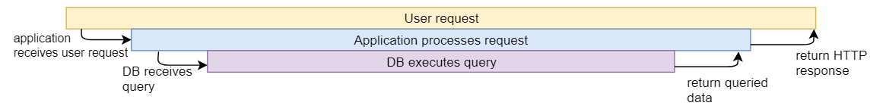
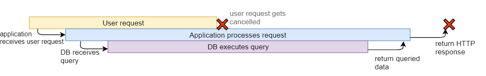

context,在官方包的解释中是

> // Package context defines the Context type, which carries deadlines,
> // cancellation signals, and other request-scoped values across API boundaries
> // and between processes.

可以发现context包含存活时间，取消信号，传递的数据等，这也让context可以在中去取消或停止操作。

\* 注：当一个服务调用另一个服务的接口时，需要设置超时时间，否则另一个服务接口出现死锁或其他情况会影响当前服务的质量。

## Context

正常情况下，调用其他接口应向下图所示：

但如果顶层请求中途退出，但下层却还会继续执行，这浪费了正常的资源：

那么context实现的功能效果如下：

上述是顶层主动取消的示例。

并且，context还可以实现超时取消的功能。

### Context接口

Context是一个接口，包含以下4个方法。

~~~go
type Context interface {
	Deadline() (deadline time.Time, ok bool)
	Done() <-chan struct{}
	Err() error
	Value(key interface{}) interface{}
}
~~~

* Deadline() 返回Context被取消的时间

* Done() 返回一个管道，当工作完成或者取消之后关闭
* Err() 返回Context结束的原因，只有Done()的管道被关闭时才会返回非空的值。无论是正常结束还是超时都会有返回值。
* Value(), 从Context中获取键对应的值，这是Context传递数据的方法。

### context结构体

context结构体分为3中类型

#### emptyCtx

经典吓唬人的整型来了，因为空上下文没有取消和定时取消的功能，所以使用整形并实现接口（全部直接返回空），一般时最顶层的请求使用空上下文。

~~~go
// An emptyCtx is never canceled, has no values, and has no deadline. It is not
// struct{}, since vars of this type must have distinct addresses.
type emptyCtx int
var (
	background = new(emptyCtx)
	todo       = new(emptyCtx)
)
func (*emptyCtx) Deadline() (deadline time.Time, ok bool) {
	return
}

func (*emptyCtx) Done() <-chan struct{} {
	return nil
}

func (*emptyCtx) Err() error {
	return nil
}

func (*emptyCtx) Value(key interface{}) interface{} {
	return nil
}

func Background() Context {
	return background
}

func TODO() Context {
	return todo
}
~~~

可以看到经常使用的Background函数也就是返回一个空的上下文，不包含任何信息。

#### cancelCtx

~~~go
// A cancelCtx can be canceled. When canceled, it also cancels any children
// that implement canceler.
type cancelCtx struct {
	Context

	mu       sync.Mutex            // protects following fields
	done     chan struct{}         // created lazily, closed by first cancel call
	children map[canceler]struct{} // set to nil by the first cancel call
	err      error                 // set to non-nil by the first cancel call
}
func (c *cancelCtx) Value(key interface{}) interface{} {
	if key == &cancelCtxKey {
		return c
	}
	return c.Context.Value(key)
}

func (c *cancelCtx) Done() <-chan struct{} {
	c.mu.Lock()
	if c.done == nil {
		c.done = make(chan struct{})
	}
	d := c.done
	c.mu.Unlock()
	return d
}

func (c *cancelCtx) Err() error {
	c.mu.Lock()
	err := c.err
	c.mu.Unlock()
	return err
}

~~~

而在取消时，会调用cancel方法，由于代码较长就放进来了，作用是将context的孩子和本身全部取消掉，只需要关闭done管道就可以。

#### timerCtx

~~~go
type timerCtx struct {
	cancelCtx
	timer *time.Timer // Under cancelCtx.mu.

	deadline time.Time
}
~~~

具体函数实现在context/context.go文件中，官方代码贴太长有凑长度的嫌疑，实际上在使用WithDeadline/WithTimeOut函数创建定时上下文时，就已经指定了一个定时任务：

~~~go
	dur := time.Until(d)
	if dur <= 0 {
		c.cancel(true, DeadlineExceeded) // deadline has already passed
		return c, func() { c.cancel(false, Canceled) }
	}
	c.mu.Lock()
	defer c.mu.Unlock()
	if c.err == nil {
		c.timer = time.AfterFunc(dur, func() {
			c.cancel(true, DeadlineExceeded)
		})
	}
~~~

调用cancel的核心功能就是，将当前context和他的孩子context的done管道关闭。这样，其他代码如：<-done()，就会得知context超时了。

## trpc-go中的应用

### 超时取消

在client调用中，既可以自己显示指定超时任务，也可以在配置文件中写入后由框架自动完成。

#### 自己传入

以调用going服务使用ilive协议为例，其调用方法是：

~~~go
func Do(ctx context.Context, cmd uint32, subCmd uint32, head *ilive.ILiveRequest, reqBody proto.Message, rspBody proto.Message, opts ...client.Option) error {
	serviceName := fmt.Sprintf("0x%x", cmd)
~~~

可以自己传入一个timerCtx，实际上看过源码之后就知道可以使用WithDeadline/WithTimeOut函数初始化一个定时上下文，然后传入第一个参数。
